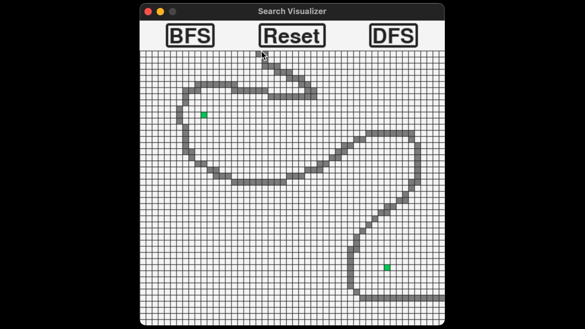
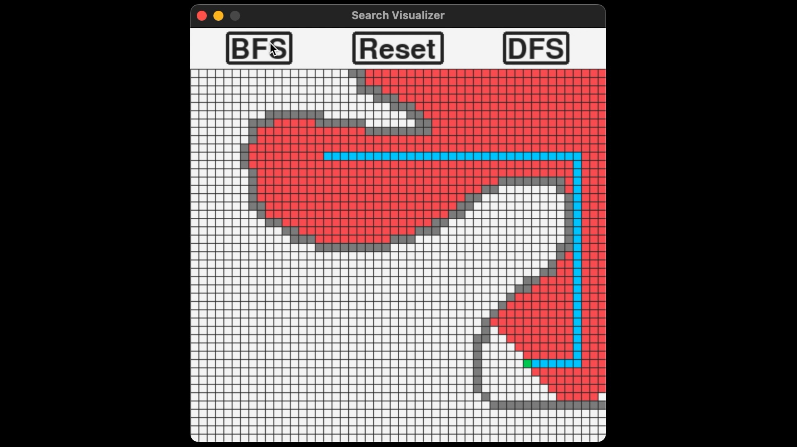

# Search Visualizer
### This repository contains a visualization tool for breadth-first and depth-first searching algorithms.

To run visualization, run `python main.py`. The visualization will search starting from the top-left green square, and finish at the bottom-right green square. First, use the mouse to draw "walls" on the grid that the search is not allowed to go through. 
 
Then click either the BFS button to run a breadth-first search or the DFS button to run a depth-first search. 
 
Red tiles indicate that the tile has been searched, blue tiles are the tiles along the path the search algorithm found from the start tile to the end tile.

Full documentation can be found on my website [here](https://www.briangood.dev/Projects/search_visualizer/docs/index.html).
